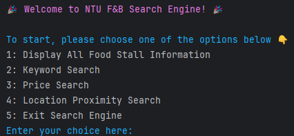

# 🍽 NTU F&B Search Engine

  
*Here's the main menu in PyCharm^^*

## 📖 Overview
A Python program that helps NTU students/staff find canteens based on:
- **Keyword search** (e.g., "Western AND Fries")
- **Price filtering** (e.g., "< $5")
- **Location proximity** (click on NTU map)

## 🚀 Features
- Logical AND/OR keyword parsing
- PyGame-based map location selection
- Fuzzy keyword matching for typos
- Color-coded terminal UI

## 🛠 Setup
```bash
# Install dependencies
pip install pygame pandas openpyxl

# Run the program
python src/ntu_fnb_search.py
```

## 📂 File Structure
```
data/           # Excel dataset
images/         # Map and icons
src/            # Python code
docs/           # Report and documentation
```

## 📊 Example Searches
### Keyword Search
```
Enter food type: Japanese or Korean
1. Food Court 11 - Kimkimbap (Matched 1 keyword)
2. Foodgle Food Court - Koreantown (Matched 1 keyword)
```

### Price Search
```
Enter food type: Chicken
Max price: 4
1. Food Court 1 - Kee Chicken Rice: $3.50
```

## 📜 Documentation
- [Original README](docs/README-U2422300F.docx)

## ⚠️ Note
Dataset paths are hardcoded to expect files in `data/` and `images/`. Modify `ntu_fnb_search.py` if needed.
